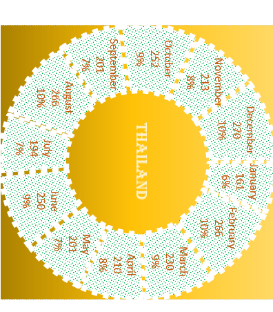

# 📊 Dynamic Productivity Dashboard in Excel

An interactive and visually engaging **Excel Dashboard** that displays monthly productivity using a **dynamic Doughnut Chart**. This project demonstrates how advanced Excel features can be combined to create professional dashboards without VBA or Power Query.

---

## 📌 Project Overview

The **Dynamic Productivity Dashboard** allows users to analyze monthly productivity through an interactive circular visualization. By selecting different options from a dropdown list, the dashboard updates automatically using formulas and dynamic chart references.

This project is designed to strengthen Excel dashboard development skills for aspiring **Data Analysts**.

---

## 🎯 Project Objectives

- Create an interactive Excel dashboard.
- Visualize monthly productivity in an attractive format.
- Learn dynamic chart techniques.
- Practice Excel functions used in business reporting.
- Build a portfolio-ready analytics project.

---

## 🛠️ Tools Used

- Microsoft Excel
- Doughnut Chart
- Data Validation
- XLOOKUP
- RANDBETWEEN
- Named Ranges
- Dynamic Formulas

---

## ✨ Features

- 📅 Monthly Productivity Analysis
- 🍩 Dynamic Doughnut Chart
- 📊 Automatic Percentage Calculation
- 🔄 Interactive Dropdown Selection
- 🎨 Professional Dashboard Design
- ⚡ Auto-Updating Visualization
- 📈 Business Reporting Style Dashboard
- 📌 Beginner-Friendly Implementation

---

## 📚 Excel Functions Used

| Function | Purpose |
|----------|---------|
| XLOOKUP | Retrieve selected productivity values |
| RANDBETWEEN | Generate sample productivity data |
| SUM | Calculate total productivity |
| ROUND | Round percentage values |
| IFERROR | Handle formula errors |
| Data Validation | Create interactive dropdown |
| Named Ranges | Dynamic chart references |

---

## 📂 Dashboard Preview

> *(Insert your dashboard screenshot here.)*

Example:

```
Dashboard.png
```

or

```markdown

```

---

## 📈 Dashboard Workflow

```
Random Dataset
       │
       ▼
Data Validation Dropdown
       │
       ▼
XLOOKUP Retrieves Data
       │
       ▼
Percentage Calculation
       │
       ▼
Dynamic Doughnut Chart
       │
       ▼
Interactive Dashboard
```

---

## 📁 Project Structure

```
Dynamic-Productivity-Dashboard/
│
├── Productivity Dynamic Chart.xlsx
├── README.md
├── Dashboard.png
```

---

## 💡 Skills Demonstrated

- Excel Dashboard Development
- Business Data Visualization
- Dynamic Reporting
- Dashboard Design
- Data Cleaning
- Data Analysis
- Formula Optimization
- Interactive Excel

---

## 🎯 Learning Outcomes

Through this project, I gained hands-on experience in:

- Designing interactive dashboards
- Creating dynamic Excel charts
- Applying lookup functions effectively
- Building portfolio-ready analytics projects
- Presenting business data visually

---

## 👨‍💻 Author

**Keya Karmakar**

🎓 BCA Student | Aspiring Data Analyst

### Connect with me

- 💼 LinkedIn: *(Add your LinkedIn URL)*
- 💻 GitHub: *(Add your GitHub URL)*

---

## ⭐ If you found this project helpful

If you like this project, please consider giving it a **⭐ Star** on GitHub.

It motivates me to continue building more real-world **Excel** projects.

---

